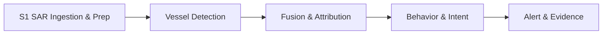

# Darkwatch 🛰️🚢

> **A radar contact with no transponder is either noise, a rig, a mismatch — or a ship that chose to disappear. Darkwatch decides which, and says how sure it is.**

<p align="center">
  <a href="https://www.python.org/downloads/"></a>
  <a href="https://pytorch.org"></a>
  
  
  <a href="https://github.com/satyamdas03/darkwatch"></a>
</p>

<p align="center">
  <b>Open-source maritime dark-vessel detection from Sentinel-1 SAR + AIS.</b><br>
  Calibrated probability · Auditable evidence · Consumer-GPU friendly
</p>

---

## 📡 Why Darkwatch?

Illegal fishing fleets, sanctions evaders, and smugglers routinely **switch off their AIS transponders** and vanish from the cooperative tracking picture. Sentinel-1 SAR pierces cloud, darkness, and non-cooperation to detect metal-on-water anywhere on Earth — and the data is **free and open**.

But a radar blip with no AIS match is **not automatically a dark vessel**. It could be:

- a wave artifact or wind streak,
- a fixed oil platform, rig, or small island,
- an innocent AIS dropout or coverage gap.

Darkwatch's core contribution is **calibrated probabilistic attribution**: for every SAR contact, it computes an honest probability that the contact is a deliberately dark vessel, and surfaces the weakest link in the evidence so humans can act with justified confidence.

This is both a real-world surveillance system and a research problem in probabilistic inference — and both live in **Phase 3**.

---

## 🎯 What Makes Darkwatch Different?

| Feature | Typical SAR-AIS pipeline | Darkwatch |
|---|---|---|
| Match logic | Nearest-neighbor join | **Gaussian likelihood + softmax normalization** over all nearby tracks |
| Uncertainty | Binary match / no-match | **Four-component probabilities**: `CLEAR`, `DARK`, `ARTIFACT`, `REVIEW` |
| Calibration | None | **Brier-score / reliability evaluation** against ground-truthable labels |
| Static objects | None | **Oil-platform / rig exclusion** shifts fixed-structure contacts to `ARTIFACT` |
| Coverage gaps | None | Explicit adjustment when no AIS exists within 2× the gate |
| Evidence | Silent | Every verdict carries a **reasoning trail**, nearest-track metadata, and interactive map |
| Cost | Enterprise AIS feeds + cloud GPUs | Free/open data + **single consumer GPU** (RTX 5060 8 GB) |

---

## 🏗️ Pipeline



1. **S1 SAR Ingestion & Prep** — download Sentinel-1 GRD, calibrate to sigma-nought, mask land with Natural Earth polygons, tile into georeferenced chips.
2. **Vessel Detection** — fine-tuned YOLOv8n detects vessel-sized contacts; VV+VH deduplication keeps the best detection.
3. **Fusion & Attribution** — interpolate AIS tracks to SAR time, compute association likelihoods, and emit calibrated `CLEAR / DARK / ARTIFACT / REVIEW` verdicts.
4. **Behavior & Intent** *(Phase 4)* — zone overlays, persistence tracking, rendezvous detection.
5. **Alert & Evidence** *(Phase 5)* — ranked dossiers with imagery, reasoning, and confidence.

---

## 🚨 Real Results — Santa Barbara Channel

### 2024-07-11: the value of static-object exclusion

The first detectable contact looked like a dark vessel until static-object exclusion was added. It was **58 m from Platform Irene**, so the verdict flipped to **ARTIFACT**:

```json
{
  "contact_id": "S1A_IW_GRDH_1SDV_20240711T140858_20240711T140923_054714_06A94E_9466_vh_c3314_r10814_det0000",
  "verdict": "ARTIFACT",
  "p_artifact": 0.6576,
  "p_clear": 0.0,
  "p_dark": 0.2568,
  "p_review": 0.0856,
  "static_object": {
    "name": "Platform Irene",
    "distance_m": 58.0,
    "confidence": 0.7678
  }
}
```

Full report: [`notebooks/fusion_20240711_report.md`](notebooks/fusion_20240711_report.md).

### 2024-07-18: the first mixed verdict set

A second scene produced **12 contacts** against **7 AIS tracks**:

| Verdict | Count | Examples |
|---|---|---|
| **CLEAR** | 3 | MSC GIUSY (108 m), MSC SOFIA PAZ (308 m), RYAN T (295 m) |
| **DARK** | 3 | No AIS within 2 km, no platform nearby |
| **REVIEW** | 5 | Platform nearby or distant AIS, too ambiguous to call |
| **ARTIFACT** | 1 | Platform Harvest (82 m) |

Full report: [`notebooks/fusion_20240718_report.md`](notebooks/fusion_20240718_report.md).  
Interactive map: [`notebooks/fusion_20240718_map.html`](notebooks/fusion_20240718_map.html).

### 2024-07-23: two small dark contacts in a quiet scene

A third scene produced **2 small contacts** (68 × 37 m and 46 × 15 m). Both have **no AIS track within 2 km** and **no oil platform nearby**, so both are classified **DARK**:

| Verdict | Count | Notes |
|---|---|---|
| **DARK** | 2 | Small vessels, no AIS, no platform; nearest MMSI **BERNARDINE C** 24 km away |

Full report: [`notebooks/fusion_20240723_report.md`](notebooks/fusion_20240723_report.md).  
Interactive map: [`notebooks/fusion_20240723_map.html`](notebooks/fusion_20240723_map.html).

> **Detector update (Session #7):** the mixed SSDD+GRD detector initially missed these small, low-backscatter targets. After fixing a stale-label augmentation bug and retraining `darkwatch_yolov8n_ssdd_grd_v4`, the model now recovers **both July 23 DARK vessels** — at confidences **0.764** and **0.370** with adaptive dB stretch. The SSDD→GRD domain gap is closed.

### 2024-08-11: fourth scene and calibration dataset expansion

A fourth scene produced **20 contacts** against **3 AIS tracks**:

| Verdict | Count | Examples |
|---|---|---|
| **ARTIFACT** | 15 | 7 platform-adjacent contacts + 6 oversized sea-surface patches |
| **CLEAR** | 2 | RYAN T (281 m from MMSI 367104050) |
| **DARK** | 2 | No AIS within gate, no platform nearby |
| **REVIEW** | 1 | Thin ambiguous streak |

**Critical calibration correction:** one contact matched to **KNOX T** at 995 m was so oversized (1591 m × 1543 m) that it cannot physically be the cooperative vessel. It is labeled **ARTIFACT** despite a high AIS association score, teaching the model that AIS association must be gated by plausible vessel dimensions.

Full report: [`notebooks/fusion_20240811_report.md`](notebooks/fusion_20240811_report.md).  
Interactive map: [`notebooks/fusion_20240811_map.html`](notebooks/fusion_20240811_map.html).

---

## 🚀 Quick Start

```bash
# Clone
git clone https://github.com/satyamdas03/darkwatch.git
cd darkwatch

# Install (use a virtualenv)
pip install -e ".[dev]"

# Run the test suite
python -m pytest tests/ -q

# 1. Search and download a Sentinel-1 scene over the Santa Barbara Channel
python scripts/fetch_first_scene.py --start 2024-07-01 --end 2024-07-12 --download

# 2. Pick the pass with the most open ocean
python scripts/pick_ocean_scene.py --start 2024-07-01 --end 2024-07-31

# 3. Prep the scene into calibrated, land-masked tiles
python scripts/prep_s1.py "data/raw/s1/S1A_...SAFE" \
  --output-dir data/processed/s1a_20240711_channel \
  --bbox "-120.8,34.3,-119.8,34.7" \
  --pol vv,vh

# 4. Detect vessels (dB -> uint8 contrast stretch is required for YOLO inference)
python scripts/detect_tiles.py \
  --manifest data/processed/s1a_20240711_channel/manifest.json \
  --model models/detector_runs/darkwatch_yolov8n_ssdd_grd_v4/weights/best.pt \
  --db-lo -25 --db-hi -5 \
  --pol vv,vh \
  --output-dir data/processed/detections_20240711

# For faint / low-backscatter targets, use adaptive per-tile stretch:
python scripts/detect_tiles.py \
  --manifest data/processed/s1a_20240723_channel/manifest.json \
  --model models/detector_runs/darkwatch_yolov8n_ssdd_grd_v4/weights/best.pt \
  --adaptive-percentiles 5,95 \
  --db-lo -40 --db-hi -10 --conf 0.05 \
  --pol vv,vh \
  --output-dir data/processed/detections_20240723_adaptive

# 5. Fetch NOAA Marine Cadastre AIS for the acquisition date
python scripts/fetch_ais.py --date 2024-07-11 \
  --bbox "-120.8,34.3,-119.8,34.7" \
  --center-time "2024-07-11T14:09:10Z" \
  --time-window-minutes 60

# 6. Fuse SAR contacts with AIS tracks
python scripts/fuse_contacts.py \
  --contacts data/processed/detections_20240711/contacts.json \
  --ais data/external/ais/ais_2024-07-11_clipped.csv \
  --output-dir data/processed/fusion_20240711

# 7. Generate the human-readable Markdown report
python scripts/fusion_report.py \
  --contacts data/processed/detections_20240711/contacts.json \
  --ais data/external/ais/ais_2024-07-11_clipped.csv \
  --verdicts data/processed/fusion_20240711/verdicts.json \
  --summary data/processed/fusion_20240711/summary.json \
  --output notebooks/fusion_20240711_report.md
```

> **Note:** Copernicus Data Space credentials go in `.env` (see `scripts/fetch_first_scene.py`). All downloaded scenes, models, and data are excluded from git via `.gitignore`.
>
> **Scene selection tip:** use `--operational-bbox` so you don't pick a scene that is 100% ocean but misses your theater:
> ```bash
> python scripts/pick_ocean_scene.py --start 2024-07-01 --end 2024-07-31 \
>   --operational-bbox "-120.8,34.3,-119.8,34.7"
> ```

---

## 📊 Calibration & Visualization

Darkwatch is built to be **honest about uncertainty**, not just confident.

- **`scripts/evaluate_calibration.py`** compares fusion probabilities against ground-truth labels and produces:
  - Per-class **Brier scores** (`CLEAR`, `DARK`, `ARTIFACT`).
  - **Reliability diagrams** showing predicted probability vs observed fraction.
  - Probability-distribution histograms by true label.
- **`data/processed/calibration_labels_v4_adaptive_recal2.json`** is the active auditable label source (46 contacts across four scenes: 27 ARTIFACT, 7 CLEAR, 9 DARK, 3 UNKNOWN).
- **`scripts/visualize_fusion.py`** creates interactive Folium maps with SAR contacts, AIS tracks, oil-platform markers, and 2 km gate circles.
- **`scripts/download_ais_noaa.py`** downloads NOAA daily AIS zip files with resume support.
- **`scripts/process_scene.py`** is an end-to-end wrapper: S1 download → prep tiles → detect → fetch AIS → fuse → report + map.

Latest calibration metrics (46 labels):

| Class | Labeled positives | Mean predicted | Brier score |
|---|---|---|---|
| CLEAR | 7 | 0.1168 | 0.0259 |
| DARK | 9 | 0.3394 | 0.0929 |
| ARTIFACT | 27 | 0.4411 | 0.0945 |

Run the calibration report:

```bash
python scripts/evaluate_calibration.py \
  --labels data/processed/calibration_labels_v4_adaptive_recal2.json \
  --output-dir notebooks/calibration_v4_adaptive_recal2
```

Generate a fusion map:

```bash
python scripts/visualize_fusion.py \
  --contacts data/processed/detections_20240718/contacts.json \
  --ais data/external/ais/ais_2024-07-18_clipped.csv \
  --verdicts data/processed/fusion_20240718/verdicts.json \
  --output notebooks/fusion_20240718_map.html
```

---

## 📁 Repository Layout

```text
darkwatch/
├── README.md                  # You are here
├── DOSSIER.md                 # Living project source of truth
├── LICENSE                    # MIT
├── darkwatch-architecture.html # Visual architecture reference
├── pyproject.toml             # Python package + dependencies
├── darkwatch/                 # Core Python package
│   ├── adapters/              # Swappable data-source adapters
│   ├── s1_prep/               # Sentinel-1 ingestion & prep
│   ├── detect/                # Vessel detector + contacts
│   ├── fusion/                # Probabilistic SAR-to-AIS attribution
│   ├── behavior/              # Phase 4: context & prioritization
│   └── alerts/                # Phase 5: evidence dossiers
├── scripts/                   # CLI utilities for each pipeline stage
├── tests/                     # pytest suite
├── notebooks/                 # Validation images + fusion reports
└── data/                      # Downloads & processed outputs (gitignored)
```

---

## 🛠️ Tech Stack

- **Python 3.11+** — target runtime
- **PyTorch 2.11 + CUDA 12.8** — detector training/inference on RTX 5060
- **Ultralytics YOLOv8** — SAR vessel detector
- **rasterio + geopandas + shapely + pyproj** — geospatial / SAR prep
- **scipy** — barycentric SAR geocoding
- **pandas + numpy** — AIS track interpolation and probability math
- **pytest** — testing
- **Sentinel-1 (Copernicus Data Space)** — open SAR data
- **NOAA Marine Cadastre AIS** — public US-government broadcast data
- **Natural Earth** — public-domain land polygons

---

## 📊 Roadmap

| Phase | Goal | Status |
|---|---|---|
| 0 | Recon & first real SAR on screen | ✅ |
| 1 | Automated SAR ingestion & prep | ✅ |
| 2 | Vessel detection baseline | ✅ Baseline trained; ✅ SSDD→GRD domain-gap closure complete (`darkwatch_yolov8n_ssdd_grd_v4`) |
| 3 | **Fusion & Attribution** | ✅ Baseline complete: static-object exclusion, four real scenes, 46 labeled contacts, calibration framework, interactive maps; next: learned calibration layer or more scenes |
| 4 | Behavior & intent (zones, persistence, rendezvous) | ⏳ |
| 5 | Alert & evidence dossiers | ⏳ |

**Next priorities:**
1. **Implement a learned calibration layer** (highest impact for the core goal):
   - Fit isotonic regression or Platt scaling on the 46-label dataset so that `p_dark = 0.73` actually means ~73% of similar cases are dark.
   - Use scene-level cross-validation to avoid overfitting the small dataset.
2. **Add a physical-plausibility gate for AIS matches:**
   - The KNOX T oversized mismatch (1591 m × 1543 m SAR contact vs a single cooperative vessel) shows that high association probability is not enough.
   - Penalize matches when SAR contact dimensions are incompatible with the AIS vessel type / reported size.
3. **Collect more calibration scenes** to reach ~100 labeled contacts:
   - Target busy traffic for more **CLEAR** labels and quiet open-water passes for more unambiguous **DARK** labels.
   - Use `scripts/process_scene.py` to automate the download → prep → detect → fuse → label pipeline.
4. **Adaptive-stretch production path:** decide when to use default vs adaptive dB stretch based on scene statistics, and expose the choice cleanly in the CLI/API.
5. **Begin Phase 4 behavior context:** integrate public MPA / EEZ / fishing-zone overlays and start persistence tracking across repeat passes.

---

## 📚 Data & Licensing

- **Sentinel-1 SAR** is fully open under the Copernicus free and open data policy.
- **NOAA Marine Cadastre AIS** is public US-government data.
- **Natural Earth** `ne_50m_land` is public domain.
- Open SAR ship-detection datasets (**SSDD**, **HRSID**, **LS-SSDD-v1.0**) should be verified individually before training or redistribution.

---

## 🤝 Contributing

Contributions that improve **calibration, attribution honesty, or data accessibility** are especially welcome:

- Better detector backbones or GRD-domain fine-tuning recipes.
- Static-object exclusion datasets for the Santa Barbara Channel and beyond.
- Additional AIS adapters (Global Fishing Watch, terrestrial AIS, etc.).
- Calibration studies on real-world ground-truthable cases.

Please open an issue or PR. For the full project state and rationale, read [`DOSSIER.md`](DOSSIER.md) first.

---

## 📖 Citation

If you use Darkwatch in research, please cite the repository and the open data sources:

```bibtex
@software{darkwatch2026,
  author = {Satyam Das},
  title = {Darkwatch: Open-Source Dark-Vessel Detection from Sentinel-1 SAR and AIS},
  url = {https://github.com/satyamdas03/darkwatch},
  year = {2026}
}
```

---

## 🧑‍💻 Author

Built by **Satyam Das** with the help of **Bull** (Claude Code agent).

- GitHub: [@satyamdas03](https://github.com/satyamdas03)
- LinkedIn: [Satyam Das](https://linkedin.com/in/satyam-das-36040a24b)
- Email: satyamdas03@gmail.com

If Darkwatch helps your research or operation, please ⭐ the repo and share what you build.

---

*Darkwatch is a research/engineering prototype. Verdicts are candidate flags for human review, not legal accusations.*
