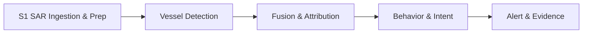

# Darkwatch 🛰️🚢

> **A radar contact with no transponder is either noise, a rig, a mismatch — or a ship that chose to disappear. Darkwatch decides which, and says how sure it is.**

<p align="center">
  <a href="https://www.python.org/downloads/"></a>
  <a href="https://pytorch.org"></a>
  
  
  <a href="https://github.com/satyamdas03/darkwatch"></a>
</p>

<p align="center">
  <b>Open-source maritime dark-vessel detection from Sentinel-1 SAR + AIS.</b><br>
  Calibrated probability · Auditable evidence · Consumer-GPU friendly
</p>

---

## 📡 Why Darkwatch?

Illegal fishing fleets, sanctions evaders, and smugglers routinely **switch off their AIS transponders** and vanish from the cooperative tracking picture. Sentinel-1 SAR pierces cloud, darkness, and non-cooperation to detect metal-on-water anywhere on Earth — and the data is **free and open**.

But a radar blip with no AIS match is **not automatically a dark vessel**. It could be:

- a wave artifact or wind streak,
- a fixed oil platform, rig, or small island,
- an innocent AIS dropout or coverage gap.

Darkwatch's core contribution is **calibrated probabilistic attribution**: for every SAR contact, it computes an honest probability that the contact is a deliberately dark vessel, and surfaces the weakest link in the evidence so humans can act with justified confidence.

This is both a real-world surveillance system and a research problem in probabilistic inference — and both live in **Phase 3**.

---

## 🎯 What Makes Darkwatch Different?

| Feature | Typical SAR-AIS pipeline | Darkwatch |
|---|---|---|
| Match logic | Nearest-neighbor join | **Gaussian likelihood + softmax normalization** over all nearby tracks |
| Uncertainty | Binary match / no-match | **Four-component probabilities**: `CLEAR`, `DARK`, `ARTIFACT`, `REVIEW` |
| Calibration | None | **Brier-score / reliability evaluation** + learned per-class Platt calibration |
| Static objects | None | **Oil-platform / rig exclusion** shifts fixed-structure contacts to `ARTIFACT` |
| AIS-match gate | None | **Physical-plausibility gate** rejects oversized SAR contacts falsely matched to small cooperative vessels |
| Coverage gaps | None | Explicit adjustment when no AIS exists within 2× the gate |
| Evidence | Silent | Every verdict carries a **reasoning trail**, nearest-track metadata, and interactive map |
| Cost | Enterprise AIS feeds + cloud GPUs | Free/open data + **single consumer GPU** (RTX 5060 8 GB) |

---

## 🏗️ Pipeline



1. **S1 SAR Ingestion & Prep** — download Sentinel-1 GRD, calibrate to sigma-nought, mask land with Natural Earth polygons, tile into georeferenced chips.
2. **Vessel Detection** — fine-tuned YOLOv8n detects vessel-sized contacts; VV+VH deduplication keeps the best detection.
3. **Fusion & Attribution** — interpolate AIS tracks to SAR time, compute association likelihoods, and emit calibrated `CLEAR / DARK / ARTIFACT / REVIEW` verdicts.
4. **Behavior & Intent** *(Phase 4)* — zone overlays, persistence tracking, rendezvous detection.
5. **Alert & Evidence** *(Phase 5)* — ranked dossiers with imagery, reasoning, and confidence.

---

## 🚨 Real Results — Santa Barbara Channel

### 2024-07-11: the value of static-object exclusion

The first detectable contact looked like a dark vessel until static-object exclusion was added. It was **72 m from Platform Irene**, so the verdict flipped to **ARTIFACT**:

```json
{
  "contact_id": "S1A_IW_GRDH_1SDV_20240711T140858_20240711T140923_054714_06A94E_9466_vh_c3314_r10814_det0000",
  "verdict": "ARTIFACT",
  "p_artifact": 0.8929,
  "p_clear": 0.0,
  "p_dark": 0.0840,
  "p_review": 0.0231,
  "static_object": {
    "name": "Platform Irene",
    "distance_m": 72.1,
    "confidence": 0.7117
  }
}
```

Full report: [`notebooks/fusion_20240711_v4_adaptive_recal3_report.md`](notebooks/fusion_20240711_v4_adaptive_recal3_report.md).

### 2024-07-18: the first mixed verdict set

A second scene produced **12 contacts** against **7 AIS tracks**:

| Verdict | Count | Examples |
|---|---|---|
| **CLEAR** | 3 | MSC GIUSY (108 m), MSC SOFIA PAZ (308 m), RYAN T (295 m) |
| **DARK** | 3 | No AIS within 2 km, no platform nearby |
| **REVIEW** | 5 | Platform nearby or distant AIS, too ambiguous to call |
| **ARTIFACT** | 1 | Platform Harvest (82 m) |

Full report: [`notebooks/fusion_20240718_v4_adaptive_recal3_report.md`](notebooks/fusion_20240718_v4_adaptive_recal3_report.md).  
Interactive map: [`notebooks/fusion_20240718_v4_adaptive_recal3_map.html`](notebooks/fusion_20240718_v4_adaptive_recal3_map.html).

### 2024-07-23: two small dark contacts in a quiet scene

A third scene produced **2 small contacts** (68 × 37 m and 46 × 15 m). Both have **no AIS track within 2 km** and **no oil platform nearby**, so both are classified **DARK**:

| Verdict | Count | Notes |
|---|---|---|
| **DARK** | 2 | Small vessels, no AIS, no platform; nearest MMSI **BERNARDINE C** 24 km away |

Full report: [`notebooks/fusion_20240723_v4_adaptive_recal3_report.md`](notebooks/fusion_20240723_v4_adaptive_recal3_report.md).  
Interactive map: [`notebooks/fusion_20240723_v4_adaptive_recal3_map.html`](notebooks/fusion_20240723_v4_adaptive_recal3_map.html).

> **Detector update (Session #7):** the mixed SSDD+GRD detector initially missed these small, low-backscatter targets. After fixing a stale-label augmentation bug and retraining `darkwatch_yolov8n_ssdd_grd_v4`, the model now recovers **both July 23 DARK vessels** — at confidences **0.764** and **0.370** with adaptive dB stretch. The SSDD→GRD domain gap is closed.

### 2024-08-11: fourth scene and the KNOX T plausibility lesson

A fourth scene produced **20 contacts** against **3 AIS tracks**:

| Verdict | Count | Examples |
|---|---|---|
| **ARTIFACT** | 16 | 7 platform-adjacent contacts + 6 oversized sea-surface patches + KNOX T mismatch |
| **CLEAR** | 1 | RYAN T (281 m from MMSI 367104050) |
| **DARK** | 3 | No AIS within gate, no platform nearby |
| **REVIEW** | 0 | — |

**Critical calibration correction:** two strong AIS matches were physically implausible:
- **KNOX T** (32 m) matched a **1591 m × 1543 m** SAR contact at 995 m.
- **OCEAN SENTINEL** (20 m) matched a **1950 m × 1129 m** SAR contact at 1644 m.

After applying the physical-plausibility gate, both are now classified **ARTIFACT** instead of CLEAR. This teaches the model that a high AIS association score is necessary but not sufficient — the SAR contact dimensions must be compatible with the cooperative vessel.

Full report: [`notebooks/fusion_20240811_v4_adaptive_recal3_report.md`](notebooks/fusion_20240811_v4_adaptive_recal3_report.md).  
Interactive map: [`notebooks/fusion_20240811_v4_adaptive_recal3_map.html`](notebooks/fusion_20240811_v4_adaptive_recal3_map.html).

### 2024-08-16 & 2024-08-28: scaling the Santa Barbara dataset

Two additional ascending nighttime passes over the western Santa Barbara Channel were added to expand the calibration set. The August 28 scene contained two strong AIS matches to **OSAKA BAY** (CLEAR) and several low-confidence northern tile-edge artifacts.

| Scene | Contacts | CLEAR | DARK | ARTIFACT |
|---|---|---|---|---|
| 2024-08-16 | 6 | 0 | 0 | 6 |
| 2024-08-28 | 12 | 2 | 0 | 10 |

Reports: [`fusion_20240816_report.md`](notebooks/fusion_20240816_report.md) · [`fusion_20240828_report.md`](notebooks/fusion_20240828_report.md)  
Maps: [`fusion_20240816_map.html`](notebooks/fusion_20240816_map.html) · [`fusion_20240828_map.html`](notebooks/fusion_20240828_map.html)

### 2024-07-08: Gulf of Mexico out-of-sample validation

A descending pass offshore Louisiana (`-90.3,28.2,-89.5,28.8`) was processed end-to-end to test generalization. After fixing the AIS center-time bug, the pipeline recovered **5 AIS tracks** and **58 contacts**. Manual review produced **42 DARK**, **3 CLEAR**, and **13 ARTIFACT** labels. This scene is held out of the combined training set only in evaluation; it is included in `calibration_labels_v4_adaptive_combined.json` for the cross-theater default model.

The Gulf static-object catalog (BOEM/BSEE platforms) was added in Session #13.5 and is now applied via `--theater gulf`. For this specific pass no contact fell within 250 m of the 30 platforms inside the bbox, confirming the manual ARTIFACT labels were oversized azimuth-ambiguity / wind-streak artifacts rather than platform contacts.

Report: [`fusion_20240708_report.md`](notebooks/fusion_20240708_report.md)  
Map: [`fusion_20240708_map.html`](notebooks/fusion_20240708_map.html)

---

## 🚀 Quick Start

```bash
# Clone
git clone https://github.com/satyamdas03/darkwatch.git
cd darkwatch

# Install (use a virtualenv)
pip install -e ".[dev]"

# Run the test suite
python -m pytest tests/ -q

# 1. Search and download a Sentinel-1 scene over the Santa Barbara Channel
python scripts/fetch_first_scene.py --start 2024-07-01 --end 2024-07-12 --download

# 2. Pick the pass with the most open ocean
python scripts/pick_ocean_scene.py --start 2024-07-01 --end 2024-07-31

# 3. Prep the scene into calibrated, land-masked tiles
python scripts/prep_s1.py "data/raw/s1/S1A_...SAFE" \
  --output-dir data/processed/s1a_20240711_channel \
  --bbox "-120.8,34.3,-119.8,34.7" \
  --pol vv,vh

# 4. Detect vessels (adaptive per-tile stretch is now the default for v4)
python scripts/detect_tiles.py \
  --manifest data/processed/s1a_20240711_channel/manifest.json \
  --model models/detector_runs/darkwatch_yolov8n_ssdd_grd_v4/weights/best.pt \
  --adaptive-percentiles 1,99 \
  --conf 0.05 \
  --pol vv,vh \
  --output-dir data/processed/detections_20240711_v4_adaptive

# Or use a fixed dB range for bright, high-contrast scenes:
python scripts/detect_tiles.py \
  --manifest data/processed/s1a_20240711_channel/manifest.json \
  --model models/detector_runs/darkwatch_yolov8n_ssdd_grd_v4/weights/best.pt \
  --db-lo -25 --db-hi -5 \
  --pol vv,vh \
  --output-dir data/processed/detections_20240711_v4_default

# 5. Fetch NOAA Marine Cadastre AIS for the acquisition date
python scripts/fetch_ais.py --date 2024-07-11 \
  --bbox "-120.8,34.3,-119.8,34.7" \
  --center-time "2024-07-11T14:09:10Z" \
  --time-window-minutes 60

# 6. Fuse SAR contacts with AIS tracks (--theater auto-selects calibration model)
python scripts/fuse_contacts.py \
  --contacts data/processed/detections_20240711_v4_adaptive/contacts.json \
  --ais data/external/ais/ais_2024-07-11_clipped.csv \
  --output-dir data/processed/fusion_20240711_v4_adaptive \
  --theater santa_barbara

# 6b. Override the default calibration model explicitly
python scripts/fuse_contacts.py \
  --contacts data/processed/detections_20240711_v4_adaptive/contacts.json \
  --ais data/external/ais/ais_2024-07-11_clipped.csv \
  --output-dir data/processed/fusion_20240711_v4_adaptive_calibrated \
  --theater santa_barbara \
  --calibration-model data/processed/fusion_calibration_v4_adaptive_combined.json

# For a Gulf of Mexico scene, --theater gulf uses the BOEM platform catalog + combined calibration:
# python scripts/fuse_contacts.py ... --theater gulf

# For the Southern California Bight, --theater southern_california uses the OSPR
# platform catalog + SCB-specific calibration model.

# 7. Generate the human-readable Markdown report
python scripts/fusion_report.py \
  --contacts data/processed/detections_20240711_v4_adaptive/contacts.json \
  --ais data/external/ais/ais_2024-07-11_clipped.csv \
  --verdicts data/processed/fusion_20240711_v4_adaptive/verdicts.json \
  --summary data/processed/fusion_20240711_v4_adaptive/summary.json \
  --output notebooks/fusion_20240711_v4_adaptive_report.md
```

> **Note:** Copernicus Data Space credentials go in `.env` (see `scripts/fetch_first_scene.py`). All downloaded scenes, models, and data are excluded from git via `.gitignore`. For a new theater, collect ~20 local labels and run `scripts/fit_calibration.py` before trusting calibrated probabilities.
>
> **Scene selection tip:** use `--operational-bbox` so you don't pick a scene that is 100% ocean but misses your theater:
> ```bash
> python scripts/pick_ocean_scene.py --start 2024-07-01 --end 2024-07-31 \
>   --operational-bbox "-120.8,34.3,-119.8,34.7"
> ```

---

## 📊 Calibration & Visualization

Darkwatch is built to be **honest about uncertainty**, not just confident.

- **`scripts/evaluate_calibration.py`** compares fusion probabilities against ground-truth labels and produces:
  - Per-class **Brier scores** (`CLEAR`, `DARK`, `ARTIFACT`).
  - **Reliability diagrams** showing predicted probability vs observed fraction.
  - Probability-distribution histograms by true label.
- **`data/processed/calibration_labels_v4_adaptive_combined.json`** is the active auditable label source (122 contacts across Santa Barbara + Gulf of Mexico: 56 ARTIFACT, 12 CLEAR, 51 DARK, 3 UNKNOWN).
- **`data/processed/fusion_calibration_v4_adaptive_combined.json`** is the saved per-class Platt calibration model applied at inference by default.
- **`scripts/fit_calibration.py`** fits a new calibration model from labels and raw verdicts.
- **`scripts/visualize_fusion.py`** creates interactive Folium maps with SAR contacts, AIS tracks, oil-platform markers, and 2 km gate circles.
- **`scripts/download_ais_noaa.py`** downloads NOAA daily AIS zip files with resume support.
- **`scripts/process_scene.py`** is an end-to-end wrapper: S1 download → prep tiles → detect → fetch AIS → fuse → report + map.
- **`scripts/fetch_zones.py`** downloads MPA / maritime zone GeoJSON for a bbox from the NOAA MPA Inventory.
- **`darkwatch serve`** launches the analyst web dashboard on `http://127.0.0.1:8050`.

### Launch the analyst dashboard

```bash
darkwatch serve
```

The dashboard auto-discovers processed scenes under `data/processed`, ranks contacts by actionable verdict (DARK → REVIEW → CLEAR → ARTIFACT), embeds the generated Folium map, shows a SAR review-grid thumbnail on each alert card, offers a one-click **Export CSV**, displays MPA/zone overlap, and flags **persistent** contacts that reappear within 500 m across multiple processed scenes. The right-side evidence panel also shows contact geometry, AIS context, static-object hits, and the full reasoning trail.

Latest combined calibration metrics (122 labels, in-sample after gate + calibration):

| Class | Labeled positives | Mean predicted | Brier score |
|---|---|---|---|
| CLEAR | 12 | 0.0566 | 0.0311 |
| DARK | 51 | 0.4490 | 0.1428 |
| ARTIFACT | 56 | 0.5231 | 0.1653 |

Run the calibration report:

```bash
python scripts/evaluate_calibration.py \
  --labels data/processed/calibration_labels_v4_adaptive_combined.json \
  --calibration-model data/processed/fusion_calibration_v4_adaptive_combined.json \
  --output-dir notebooks/calibration_combined_insample
```

Generate a fusion map:

```bash
python scripts/visualize_fusion.py \
  --contacts data/processed/detections_20240718_v4_adaptive/contacts.json \
  --ais data/external/ais/ais_2024-07-18_clipped.csv \
  --verdicts data/processed/fusion_20240718_v4_adaptive/verdicts.json \
  --output notebooks/fusion_20240718_v4_adaptive_map.html
```

### Cross-theater validation lesson

A calibration model trained only on Santa Barbara **does not transfer** cleanly to the Gulf of Mexico. On 58 out-of-sample Gulf labels:

| Model | DARK Brier | ARTIFACT Brier | CLEAR Brier |
|---|---|---|---|
| Raw fusion | 0.1606 | 0.1653 | 0.0036 |
| Recal3 (46 SB labels) | 0.1472 | 0.1674 | 0.0005 |
| Recal4 (64 SB labels) | 0.2593 | 0.1932 | 0.0067 |
| **Combined (122 SB + Gulf labels)** | **0.1631** | **0.1450** | **0.0045** |

The Santa-Barbara-only recal4 model is artifact-heavy (43/64 ARTIFACT) and suppresses DARK probabilities too strongly in a theater where most real contacts are dark. The combined cross-theater model balances both. **Operational rule:** collect ~20 local labels before trusting calibrated probabilities in a new theater; raw probabilities may be safer until local calibration is available.

---

## 📁 Repository Layout

```text
darkwatch/
├── README.md                  # You are here
├── DOSSIER.md                 # Living project source of truth
├── LICENSE                    # MIT
├── darkwatch-architecture.html # Visual architecture reference
├── pyproject.toml             # Python package + dependencies
├── darkwatch/                 # Core Python package
│   ├── adapters/              # Swappable data-source adapters
│   ├── s1_prep/               # Sentinel-1 ingestion & prep
│   ├── detect/                # Vessel detector + contacts
│   ├── fusion/                # Probabilistic SAR-to-AIS attribution
│   ├── behavior/              # Phase 4: context & prioritization
│   └── alerts/                # Phase 5: evidence dossiers
├── scripts/                   # CLI utilities for each pipeline stage
├── tests/                     # pytest suite
├── notebooks/                 # Validation images + fusion reports
└── data/                      # Downloads & processed outputs (gitignored)
```

---

## 🛠️ Tech Stack

- **Python 3.11+** — target runtime
- **PyTorch 2.11 + CUDA 12.8** — detector training/inference on RTX 5060
- **Ultralytics YOLOv8** — SAR vessel detector
- **rasterio + geopandas + shapely + pyproj** — geospatial / SAR prep
- **scipy** — barycentric SAR geocoding
- **pandas + numpy** — AIS track interpolation and probability math
- **pytest** — testing
- **Sentinel-1 (Copernicus Data Space)** — open SAR data
- **NOAA Marine Cadastre AIS** — public US-government broadcast data
- **Natural Earth** — public-domain land polygons

---

## 📊 Roadmap

| Phase | Goal | Status |
|---|---|---|
| 0 | Recon & first real SAR on screen | ✅ |
| 1 | Automated SAR ingestion & prep | ✅ |
| 2 | Vessel detection baseline | ✅ Baseline trained; ✅ SSDD→GRD domain-gap closure complete (`darkwatch_yolov8n_ssdd_grd_v4`) |
| 3 | **Fusion & Attribution** | ✅ Complete: static-object exclusion, physical-plausibility AIS gate, learned per-class Platt calibration, 122 labeled contacts across Santa Barbara + Gulf of Mexico, cross-theater validation, **theater-aware calibration registry**, SCB-specific model |
| 4 | **Analyst dashboard & behavior context** | 🚧 In progress: deep-ocean slate UI, Verdict Dial, contact list / map / dossier |
| 5 | Alert & evidence dossiers | ⏳ |

**Next priorities:**
1. **Analyst web dashboard (Phase 4/D):** FastAPI backend serving verdicts, static HTML/JS frontend with scene map, contact list with filters, Verdict Dial, and evidence dossier panel.
2. **Manual SCB label refinement:** review ~20 high-confidence SCB contacts from `notebooks/contact_viz_20240706_v4_adaptive/` to replace auto-labels with audited ground truth.
3. **Begin Phase 5 behavior context:** integrate public MPA / EEZ / fishing-zone overlays and start persistence tracking across repeat passes.

---

## 📚 Data & Licensing

- **Sentinel-1 SAR** is fully open under the Copernicus free and open data policy.
- **NOAA Marine Cadastre AIS** is public US-government data.
- **Natural Earth** `ne_50m_land` is public domain.
- Open SAR ship-detection datasets (**SSDD**, **HRSID**, **LS-SSDD-v1.0**) should be verified individually before training or redistribution.

---

## 🤝 Contributing

Contributions that improve **calibration, attribution honesty, or data accessibility** are especially welcome:

- Better detector backbones or GRD-domain fine-tuning recipes.
- Static-object exclusion datasets for the Santa Barbara Channel and beyond.
- Additional AIS adapters (Global Fishing Watch, terrestrial AIS, etc.).
- Calibration studies on real-world ground-truthable cases.

Please open an issue or PR. For the full project state and rationale, read [`DOSSIER.md`](DOSSIER.md) first.

---

## 📖 Citation

If you use Darkwatch in research, please cite the repository and the open data sources:

```bibtex
@software{darkwatch2026,
  author = {Satyam Das},
  title = {Darkwatch: Open-Source Dark-Vessel Detection from Sentinel-1 SAR and AIS},
  url = {https://github.com/satyamdas03/darkwatch},
  year = {2026}
}
```

---

## 🧑‍💻 Author

Built by **Satyam Das** with the help of **Bull** (Claude Code agent).

- GitHub: [@satyamdas03](https://github.com/satyamdas03)
- LinkedIn: [Satyam Das](https://linkedin.com/in/satyam-das-36040a24b)
- Email: satyamdas03@gmail.com

If Darkwatch helps your research or operation, please ⭐ the repo and share what you build.

---

*Darkwatch is a research/engineering prototype. Verdicts are candidate flags for human review, not legal accusations.*
